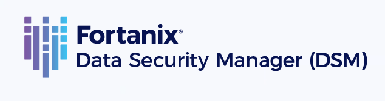
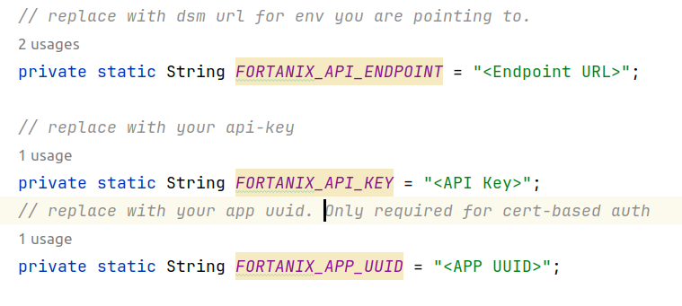

# DSMA JCE Example Project

## Project Description
This is a sample project built with Maven, supporting Java 17, and designed to be seamlessly run on any integrated development environment (IDE). This project includes example codes of performing crypto operations from Fortanix Data Security Manager(DSM).

##### Key Information Retrieval
This project also demonstrates an approach to fetch key information when you have knowledge of only key_id and/or key_name and require additional key information for creating key and cipher instances. This approach makes a call to DSM's GET key-info API (/crypto/v1/keys/{key-id}) and responds only with key metadata (NOT key material). This key metadata can be used to create a key and cipher instance and proceed with encryption. It's important to note that key metadata fetched through this approach is only intended for application logic using dsma-jce and is not cached within dsma. When the encrypt call is invoked, for dsma mode, the control flow will move to dsma library, which will make an export call to fetch key material and cache it for subsequent calls as well before performing encryption locally.

## Overview

* This Java example code demonstrates encryption/decryption, tokenization/detokenization & sign/verify operations using various cryptographic algorithms.
* It uses key-ids and key-names of existing security objects for encryption and decryption.
* After decryption, it verifies that the plaintext used for encryption matches with decrypted data to ensure data integrity.

### Features:

* AES Encryption/Decryption
* Tokenization/Detokenization
* RSA Sign/Verify

## Getting Started

To get started with this project, follow these steps:

1. Clone the repository to your local machine.

```bash
git clone https://github.com/fortanix/integrations-examples.git
```
2. Import the project into your favorite IDE. For example, in IntelliJ IDEA, go to "File" -> "Open" and select the project's root directory(DSMAJCEExamples).

## To run

1. Download DSMA JCE jar from https://support.fortanix.com/hc/en-us/articles/12717106726804-DSM-Accelerator-JCE-Provider

2. In pom.xml of this project replace `${dsma-jce.version}` & `${basedir}/path/to/jarfile/sdkms-jce-provider-bundled-dsma-${dsma-jce.version}.jar` with version & path of DSMA JCE you have downloaded.
```
<dependency>
    <!-- jar dependency provided as system with path in local directory -->
    <groupId>com.fortanix</groupId>
    <artifactId>sdkms-jce-provider-dsma</artifactId>
    <version>${dsma-jce.version}</version>
    <systemPath>${basedir}/path/to/jarfile/sdkms-jce-provider-bundled-dsma-${dsma-jce.version}.jar</systemPath>
    <scope>system</scope>
</dependency>
```
3. Two types of authentication can be used for DSMA JCE API-key authentication & Cert-based authentication.
4. For API-key authentication:-
Replace `<Endpoint URL>` & `<API Key>`in DSMAJCE.java with the relevant dsm instance you are pointing to & your api-key respectively.

5. For Cert-based authentication:-
Replace `<Endpoint URL>` & `<APP UUID>`in DSMAJCE.java with the relevant dsm instance you are pointing to & your App UUID respectively.



Also, configure the following Java properties for cert-based authentication:
```
System.setProperty("javax.net.ssl.keyStoreType", "jks");
System.setProperty("javax.net.ssl.keyStore", "<pkcs12_file_path>");
System.setProperty("javax.net.ssl.keyStorePassword", "<keystore_password>");
```

6. These environment variables can be configured in different ways:
* Using code. As shown in DSMAJCE.java provider1 & provider2 are initialized with variables setup in the code.
* Using environment variables. As shown in DSMAJCE.java provider is initialized when these environment variables are set.
* Using config file. All the configurations can be supplied through a user-defined configuration file.
The file path can be passed using the following command-line argument:
```
-Dprovider.config=/home/abc/jce.properties
```
**Note:** For detailed information & steps to configure DSMA JCE refer - https://support.fortanix.com/hc/en-us/articles/12629156140436-DSM-Accelerator-JCE-Provider

7. Replace all the `<Key UUID>` & `<Key Name>` with your security object's Key UUID & Key Name in DSMAJCE.java

8. **LOGGING:**
To Activate the debugging mode for logging set `FORTANIX_LOG_DEBUG` to true & use `FORTANIX_LOG_FOLDER` to specify the folder location for log files.
To capture detailed logs, in addition to Java application logs, Fortanix DSM-Accelerator JCE offers a `RUST_LOG` parameter. The `RUST_LOG` parameter allows you to define the desired verbosity level for enhanced logging.
To enable enhanced logging, set the environment variable to any one of the given values:
```
RUST_LOG=debug/warn/info/error/trace
```
If enhanced logging is enabled by setting the `RUST_LOG` environment variable, the log directory should mandatorily exist on the system.
The path where the detailed logs will be generated should be configured as follows:
For Linux operating system:
```
LOG_FILE=/home/user/files/logs/dsma.log
```
For Windows operating system:
```
LOG_FILE=C:\Users\Admin\DSMA\logs\dsma.log
```
However, if the log file location is not configured as environment variable, then the temporary (/temp) directory for the applicable operating system will be considered as the default log location.
For example:
For Linux operating system:
```
LOG_FILE=/tmp/jni_dsma.log
```
For Windows operating system:
```
LOG_FILE=C:\Users\Administrator\AppData\Local\Temp\2\jni_dsma.log
```

9. Run DsmaJCE class as main java application.