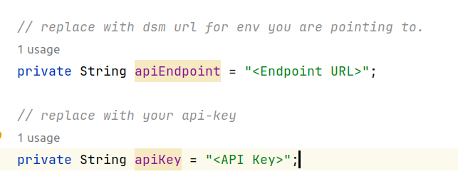

# JCE Example Project

## Overview

This Java example code demonstrates wrapping and unwrapping operations using various cryptographic algorithms, including AES, RSA, DES, and DES3 (Triple DES).

## Getting Started

To get started with this project, follow these steps:

1. Clone the repository to your local machine.

```bash
git clone https://github.com/fortanix/integrations-examples.git
```
2. Import the project into your favorite IDE. For example, in IntelliJ IDEA, go to "File" -> "Open" and select the project's root directory(JCEdemo).

## To run

1. Download JCE jar from https://support.fortanix.com/hc/en-us/articles/360018362951-JCE

2. In pom.xml of this project replace `${jce.version}` & `${basedir}/path/to/jarfile/sdkms-jce-provider-bundled-${jce.version}.jar` with version & path of JCE you have downloaded.
```
<dependency>
    <!-- jar dependency provided as system with path in local directory -->
    <groupId>com.fortanix</groupId>
    <artifactId>sdkms-jce-provider</artifactId>
    <version>${jce.version}</version>
    <systemPath>${basedir}/path/to/jarfile/sdkms-jce-provider-bundled-${jce.version}.jar</systemPath>
    <scope>system</scope>
</dependency>
```

3. Replace `<Endpoint URL>` in JCEIntegration.java with the relevant dsm instance you are pointing to.
4. Replace `<API Key>`in JCEIntegration.java with your api-key.




5. Run JCEdemo class as main java application.