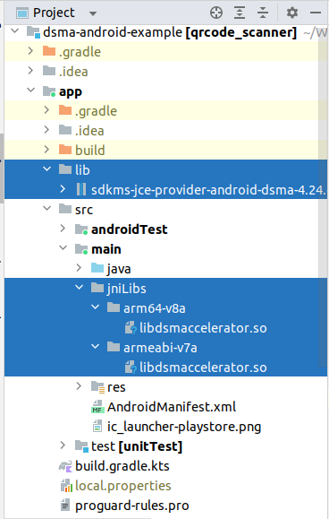
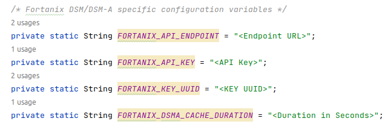
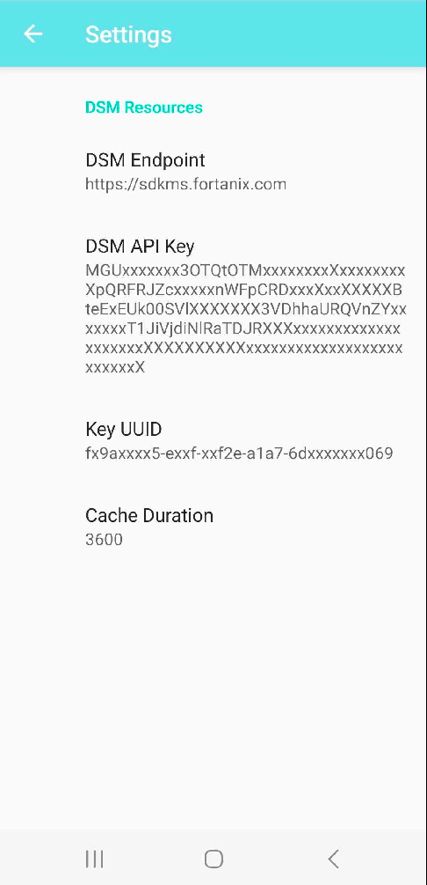
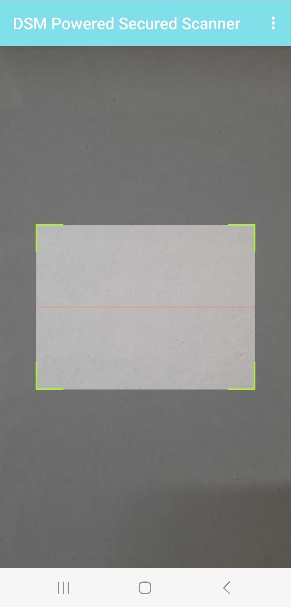
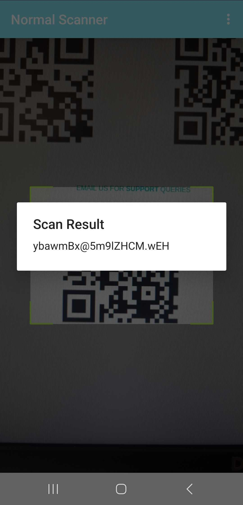
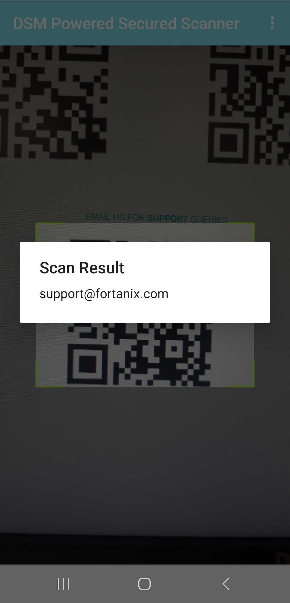

# DSMA Android Example Project

## Project Description
This is a sample project built to demonstrate the use of Fortanix DSM-Accelerator in android application. The project is built to read tokenized QRCodes and detokenize them to get actual contents.

##### Key Information Retrieval
This project also demonstrates offline detokenization where QRCodes can be read and detokenized even in low or low network areas. Key information can be fetched when you have knowledge of only key_id and/or key_name. When the detokenize call is invoked the control flow will move to dsma library, which will make an export call to fetch key material and cache it for subsequent calls as well before performing detokenization locally.

## Overview

* An android application - QRCode Scanner, capable of scanning tokenized qrcodes and barcode.
* This android example demonstrates detokenization. The Fortanix DSM-Accelerator also supports encryption/decryption, tokenization & sign/verify operations using various cryptographic algorithms.
* It uses key-ids and key-names of existing security objects for encryption/tokenization and decryption/detokenization. Offline operation only supports key_id.

### Support:

* Supports Android 10 and above
* Supports ARM and AARC64 android devices

## Pre-requisites
* Android studio
* ARM/AARCH64 based emulators/physical device
* DSM account with Group, app and security object created for tokenization and detokenization
* Tokenized QR codes

## Getting Started

To get started with this project, follow these steps:

1. Clone the repository to your local machine.

```bash
git clone https://github.com/fortanix/integrations-examples.git
```
2. Open the project into your Android Studio IDE. Go to "File" -> "Open" and select the project's root directory(dsma-android-example).

## To run

1. Download DSMA android jar and native shared library from https://support.fortanix.com/hc/en-us/articles/12717106726804-DSM-Accelerator-JCE-Provider

2. Set up android project for DSM-Accelerator
   o Add JAR to lib folder as shown in figure below
   o Add native dynamic library for a respective architecture to the corresponding directory (arm64-v8a and/or armeabi-v7a) as shown in figure below



   o Include DSMA jar dependency in build.gradle or build.gradle.kts file as follows 

```
dependencies {
    implementation(files("lib/sdkms-jce-provider-android-dsma-x.xx.devel.jar"))
}
```
3. As of today, DSMA android form-factor uses API-key authentication
 
4. For API-key authentication:-
Replace `<Endpoint URL>` & `<API Key>`in MainActivity.java with the relevant dsm instance you are pointing to & your api-key respectively as shown in the figure below.

5. For detokenization and caching keys:-
      Replace `"<KEY UUID>"` & `<Duration in Seconds>` in MainActivity.java with the relevant dsm key uuid and cache duration in seconds as shown in the figure below.




6. These variables also can be dynamically changed via application under settings menu as shown in figure below. But make sure they are defined with defaults to start with.




7. Sync gradle and build project

8. You can push application to android physical device (arm/aarch64) using wireless debugging feature

9. If you get hold of any android emulator for arm/aarch64 then you can run on to them via android studio

10. Run application and you will see scanner started as follows




11. Scan tokenized QR code




12. Normal scanner would have read tokenized QR code as follows



