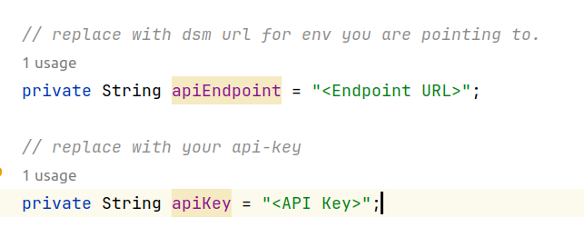
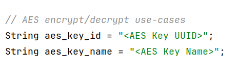

# DSMA JCE Example Project

## Project Description
This is a sample Spring Boot(3.1.3) project built with Maven, supporting Java 17, and designed to be seamlessly run on any integrated development environment (IDE). This project includes example codes of performing crypto operations from Fortanix Data Security Manager(DSM).

##### Key Information Retrieval
This project also demonstrates an approach to fetch key information when you have knowledge of only key_id and/or key_name and require additional key information for creating key and cipher instances. This approach makes a call to DSM's GET key-info API (/crypto/v1/keys/{key-id}) and responds only with key metadata (NOT key material). This key metadata can be used to create a key and cipher instance and proceed with encryption. It's important to note that key metadata fetched through this approach is only intended for application logic using dsma-jce and is not cached within dsma. When the encrypt call is invoked, for dsma mode, the control flow will move to dsma library, which will make an export call to fetch key material and cache it for subsequent calls as well before performing encryption locally.

## Overview

* This Java example code demonstrates encryption and decryption operations using various cryptographic algorithms, including AES, DES, and DES3 (Triple DES).
* It uses key-ids and key-names of existing security objects for encryption and decryption.
* After decryption, it verifies that the plaintext used for encryption matches with decrypted data to ensure data integrity.

### Features:

* AES Encryption/Decryption

* Tokenization/Detokenization

* DES Encryption/Decryption

* Triple DES (DES3) Encryption/Decryption


## Getting Started

To get started with this project, follow these steps:

1. Clone the repository to your local machine.

```bash
git clone https://github.com/fortanix/integrations-examples.git
```
2. Import the project into your favorite IDE. For example, in IntelliJ IDEA, go to "File" -> "Open" and select the project's root directory(dsmaJCEdemo).

## To run

1. Download DSMA JCE jar from https://support.fortanix.com/hc/en-us/articles/12717106726804-DSM-Accelerator-JCE-Provider

2. In pom.xml of this project replace `${dsma-jce.version}` & `${basedir}/path/to/jarfile/sdkms-jce-provider-bundled-dsma-${dsma-jce.version}.jar` with version & path of DSMA JCE you have downloaded.
```
<dependency>
    <!-- jar dependency provided as system with path in local directory -->
    <groupId>com.fortanix</groupId>
    <artifactId>sdkms-jce-provider-dsma</artifactId>
    <version>${dsma-jce.version}</version>
    <systemPath>${basedir}/path/to/jarfile/sdkms-jce-provider-bundled-dsma-${dsma-jce.version}.jar</systemPath>
    <scope>system</scope>
</dependency>
```

3. Replace `<Endpoint URL>` in JCEIntegration.java with the relevant dsm instance you are pointing to.
4. Replace `<API Key>`in JCEIntegration.java with your api-key.



5. Replace all the `<Key UUID>` & `<Key Name>` with your security object's Key UUID & Key Name in DsmaJCEdemoApplication.java



6. Run DsmaJCEdemoApplication class as main java application.